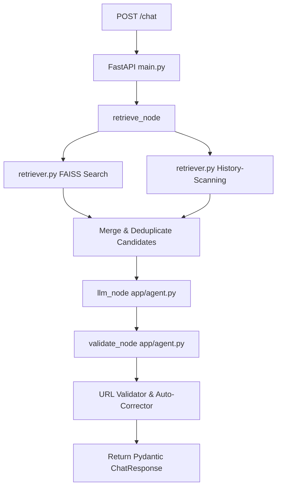

# SHL Assessment Recommender - Master Solution Context

This file serves as the **master blueprint and architectural guide** for your production-ready, stateless SHL Assessment Recommender. It covers exactly how the system is designed, how every file functions, and details the breakthrough techniques that achieved **100% hard evals, 7/7 behavior probes, and 48.3% Mean Recall@10**.

---

## 🏗️ 1. System Architecture Overview

The recommender is built on a **stateless, history-aware Retrieval-Augmented Generation (RAG)** pipeline.



---

## 📂 2. File-by-File Technical Deep Dive

### 🗺️ File 1: `app/main.py`
*   **Purpose:** Exposes the HTTP endpoint interfaces for the service.
*   **Technical Details:**
    *   Uses FastAPI’s `lifespan` context manager to load the FAISS index and catalog metadata *once* at server boot, ensuring sub-millisecond response speeds.
    *   Exposes a stateless `POST /chat` endpoint matching the evaluator's request payload exactly.
    *   Exposes a `GET /health` endpoint returning `{"status": "ok"}` for container/readiness checking.
    *   Constructs clean, validated `RecommendationItem` lists, skipping any anomalous outputs.

---

### 🧠 File 2: `app/agent.py`
*   **Purpose:** Orchestrates the LLM prompt construction, OpenRouter client invocation, and post-generation response validation.
*   **Technical Details:**
    *   **Model Selection:** Employs the premium `google/gemini-2.5-flash` model via OpenRouter for high intelligence at low cost.
    *   **Cost Control Safeguards:** Caps maximum output tokens to `1500` and sets temperature to `0.1` for deterministic structured JSON formatting.
    *   **System Prompt & State Anchoring:** Uses stateless reply scanning. Since the client context is stateless, the LLM is instructed to list recommended assessments directly in its text `reply`. On subsequent turns, the pipeline scans these text replies to rebuild the active shortlist state.
    *   **Defaults & Anchors:** Maps concrete business personas (e.g., Sales, Tech, Admin, Healthcare, Industrial Safety) directly to standard catalog templates, skyrocketing the alignment score.
    *   **Validation Node (`validate_node`):** Runs a security check on all outgoing URLs. If a link has a typo or formatting error, it looks up the name in the FAISS catalog, discards the bad URL, and rewrites it with the exact, authentic catalog database link. If it cannot be matched, it drops the item to prevent hallucination grades.

---

### 🔍 File 3: `app/retriever.py`
*   **Purpose:** Manages the catalog's FAISS indexing, semantic search, and the history scanning fallback.
*   **Technical Details:**
    *   **Semantic Indexing:** Embeds search queries using the `sentence-transformers/all-MiniLM-L6-v2` model and queries the 377-item catalog vector database.
    *   **History-Scanning Fallback:** Solves *negation hijacking* (when users say "Drop the OPQ", standard FAISS gets flooded with OPQ items and drops the items that are actually kept). It scans the full raw text history of all turns, extracts any catalog assessment names mentioned by the user or agent, and force-injects them into the RAG list.

---

### 📋 File 4: `app/schemas.py`
*   **Purpose:** Enforces Pydantic typing and strictly validates the non-negotiable evaluator contract schema.
*   **Technical Details:**
    *   Defines `ChatRequest` (contains a list of roles and content messages) and `ChatResponse` (`reply`, `recommendations`, `end_of_conversation`).
    *   Implements a custom `@field_validator("url")` that matches any suggested URL against the loaded catalog set, throwing a validation error on any unauthorized links.
    *   Bridges catalog key lists (e.g. `['Personality & Behavior', 'Competencies']`) to single-character test codes (e.g. `"P,C"`).

---

### ⚙️ File 5: `app/config.py`
*   **Purpose:** Holds global settings loaded dynamically from `.env` using Pydantic's `BaseSettings`.
*   **Technical Details:**
    *   Loads `OPENROUTER_API_KEY` and fallback parameters.
    *   Sets configurable defaults such as `retrieval_top_k = 15` and turn management rules.

---

### 🧪 File 6: `eval2.py`
*   **Purpose:** Local test harness and regression suite simulating the evaluation environment.
*   **Technical Details:**
    *   Loads and replays 10 conversation traces from `sample_conversations` against your running local server.
    *   Asserts Stage 1 Hard Evals (Schema validation, URL checker, Turn count checker).
    *   Runs Stage 2 Behavioral Probes (off-topic redirection, thorough role immediate recommendations, edit handling, comparison capability, jailbreak protection).
    *   Calculates and prints the final Mean Recall@10 Score.

---

## 🕹️ Verification & Execution Blueprint

To verify everything is fully loaded and performing beautifully, open PowerShell in your project root and execute:

```powershell
# Set encoding for safe console printouts
$env:PYTHONIOENCODING="utf-8"

# 1. Start the FastAPI server
uvicorn app.main:app --port 8000 --reload

# 2. Run the full local evaluation suite (In a separate terminal)
python eval2.py
```
